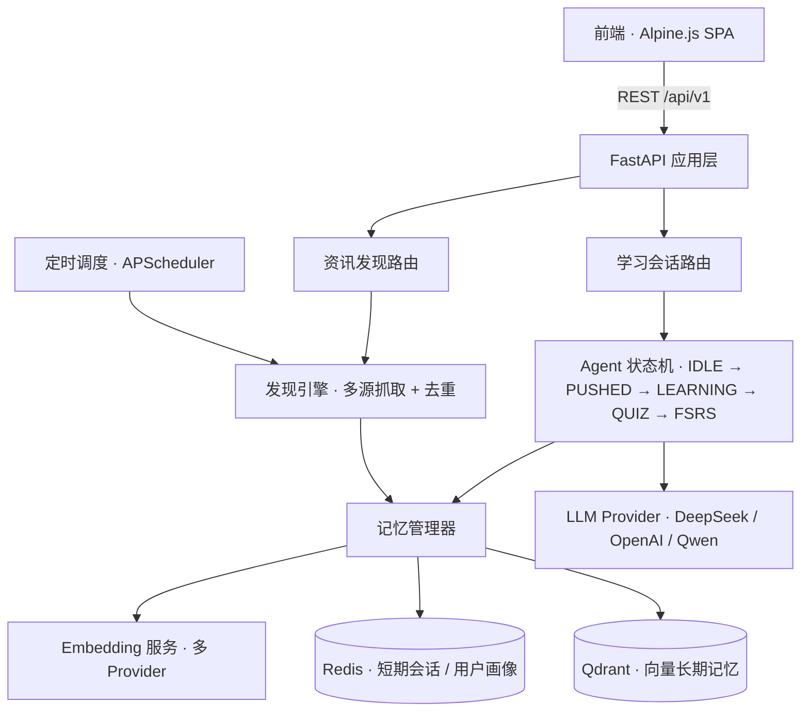

# 🚀 ILO-Agent Demo - AI 技术情报官

> **核心定位**: AI Agent 应用演示项目  
> **一句话介绍**: 一个主动帮你学新技术的 AI 助手，基于 LangGraph + LLM + 智能记忆系统  
> **技术亮点**: FastAPI · Redis · Qdrant · DeepSeek/GPT · FSRS 算法

---

## ✨ 快速开始（3 分钟）

### **前置准备**

```bash
# 必需环境
Python 3.11+ ✅
Redis (可选) ✅
Docker (可选) ✅
```

### **步骤 1: 配置 API Key**

编辑 `backend/.env` 文件：

```ini
# 选择其中之一即可（推荐 DeepSeek）
DEEPSEEK_API_KEY=sk-your-deepseek-key-here
# 或 OPENAI_API_KEY=sk-your-openai-key-here

# Redis 连接（本地运行）
REDIS_URL=redis://localhost:6379/0
QDRANT_URL=http://localhost:6333
```

获取 DeepSeek API Key: https://platform.deepseek.com/

### **步骤 2: 启动服务**

**方式 A: Python 直接运行（推荐开发）**

```bash
cd backend
pip install -r requirements.txt

# 启动 API 服务
python src/api/main.py

# 等待看到：
# [INFO] Using DeepSeek API
# INFO     Starting server...
```

**方式 B: 使用启动脚本（最简单）**

```bash
python backend/start_dev.py
# 自动完成：检查依赖 → 启动后端 → 打开前端页面
```

### **步骤 3: 访问应用**

- **API Docs**: http://localhost:8000/docs
- **前端界面**: 会自动在浏览器中打开 `frontend/index.html`

---

## 🎯 项目亮点

### **技术栈展示**

```yaml
核心技术:
  - 语言模型：DeepSeek / GPT-3.5-turbo (通过 OpenAI 兼容协议)
  - 状态管理：LangGraph Style State Machine
  - 向量存储：Qdrant Hybrid Search
  - 缓存系统：Redis Sessions & User Profiles
  - 算法实现：FSRS v2 Spaced Repetition

工程实践:
  - API 框架：FastAPI + Async/await
  - 日志系统：Loguru (解决 Windows 编码问题)
  - 数据抓取：Async HTTP Client + ETL Pipeline
  - 部署方案：Docker Compose (生产环境)
```

### **核心功能流**

```
[发现] → [推送] → [学习] → [测验] → [复习规划]
   ↓        ↓        ↓         ↓          ↓
RSS/API  定时触发   LLM 生成   互动测试   FSRS 算法计算
```

---

## 🏗️ 系统架构



### **一次完整学习链路**

```
定时 / 手动触发 → 抓取资讯 → 去重分类 → 向量入库
    → 推送通知 → 用户响应 → LLM 生成讲解 → 生成测验
    → 提交测验评分 → 映射 FSRS 评级 → 计算下次复习时间 → 写入记忆
```

### **关键设计决策**

| 决策点 | 方案与取舍 |
|---|---|
| 记忆分层 | 对比 Mem0（外部服务、依赖网络）后选择自建混合方案：Redis 存短期会话与用户画像，Qdrant 存长期向量记忆，并保留接入 Mem0 的能力 |
| LLM 抽象 | `create_llm()` 按环境变量自动探测 Provider（DeepSeek 优先 → OpenAI → 自定义），无 Key 时优雅降级，不阻断主流程 |
| 模型分工 | 对话/讲解用 DeepSeek（快且便宜），批量中文摘要用通义千问；摘要模型不可用时自动回退 |
| 向量降级 | 真实 Embedding 优先，仅在 API 不可用时使用占位向量兜底，保证写库链路不中断 |
| 异步安全 | 同时提供 sync / async 两套记忆接口，避免在事件循环内误用 `asyncio.run` |
| 跨平台 | 统一 loguru 日志并强制 UTF-8，解决 Windows 控制台编码问题 |

---

## 📁 项目结构

```
ilo-agent-demo/
├── backend/                          # FastAPI 后端服务
│   ├── src/
│   │   ├── core/                    # 核心配置模块
│   │   │   └── config.py            # 环境变量与日志初始化
│   │   ├── api/                     # API 接口层
│   │   │   ├── main.py              # FastAPI 应用入口
│   │   │   └── routes/              # 路由模块
│   │   │       ├── discover.py      # 资讯发现接口
│   │   │       └── learning.py      # 学习会话接口
│   │   └── modules/                 # 核心业务模块
│   │       ├── agent/               # ⭐⭐⭐ Agent 核心
│   │       │   ├── state_machine.py # LangGraph 风格状态机
│   │       │   ├── memory_manager.py# 分层记忆系统
│   │       │   ├── embedding_service.py # 向量化服务（多 Provider）
│   │       │   └── context.py       # 上下文对象设计
│   │       └── discovery/           # ⭐⭐ 数据采集
│   │           ├── engine.py             # RSS 爬虫引擎
│   │           ├── simplified_engine.py  # 简化版（避开兼容性问题）
│   │           ├── article_fetcher.py    # 文章抓取
│   │           ├── github_fetcher.py     # GitHub 内容抓取
│   │           ├── summary_spec.py       # 摘要生成规范
│   │           └── tech_knowledge.py     # 技术知识库
│   ├── news_scheduler.py            # 资讯抓取定时调度器
│   ├── start_dev.py                 # 一键启动脚本
│   ├── logs/                        # 日志文件
│   └── requirements.txt             # Python 依赖
│
├── frontend/                        # Web 前端
│   └── index.html                   # Alpine.js 单页面应用
│
├── docker-compose.yml               # Docker 编排
└── README.md                        # 本文件
```

---

## 🔧 核心模块详解

### **1. Agent 状态机** (`backend/src/modules/agent/state_machine.py`)

**职责**: 管理学习流程的状态流转，类似 LangGraph 的设计模式

```python
# 状态定义
IDLE → PUSHED → LEARNING → QUIZ → FSRS_UPDATE → COMPLETED

# 核心方法
- create_session(): 创建新会话
- push_notification(): 推送通知
- process_user_response(): 处理用户响应
- submit_quiz(): 提交测验
- complete_session(): 完成学习并更新记忆
```

**设计要点**: 以状态机统一管理复杂的业务流程流转

### **2. 记忆管理系统** (`backend/src/modules/agent/memory_manager.py`)

**三层架构**:
1. **短期记忆**: Redis (会话上下文，1h TTL)
2. **长期记忆**: Qdrant (用户画像，向量检索)
3. **工作记忆**: Dict (临时计算结果)

**设计要点**: 面向对话系统的分层 Memory 设计

### **3. 资讯发现引擎** (`backend/src/modules/discovery/simplified_engine.py`)

**功能**: 
- 抓取多个技术源（GitHub Trending, Hacker News 等）
- 自动去重 + 标签分类
- 存入 Qdrant 向量库

**设计要点**: 异步爬虫 + ETL Pipeline 实现

### **4. FSRS 间隔重复算法**

**原理**: 基于遗忘曲线计算下次最佳复习时间

```python
# 输入：答题表现 rating (1-4 分)
# 输出：next_interval (天数), stability(稳定性)

# 示例
rating=4 (Easy) → next_interval=15 天
rating=2 (Hard) → next_interval=3 天
```

**设计要点**: 间隔重复算法的工程化落地

---

## 🧪 测试你的安装

### **1. 后端 API 测试**

```bash
# 查看 API 文档
http://localhost:8000/docs

# 尝试调用 Discovery API
GET /api/v1/discover/news
→ 返回示例技术资讯列表

# 创建学习会话
POST /api/v1/learning/session
{
  "user_id": "test-user",
  "news_item_id": "news-001",
  "time_budget": 15
}
→ 返回 session_id
```

### **2. LLM 连接测试**

```bash
# 运行状态机测试（会显示 LLM 配置）
cd backend
python src/modules/agent/state_machine.py
```

**成功标志**:
```
22:25:08 | INFO     | __main__ - Using DeepSeek API
```

---

## 🎬 功能演示流程

### **3 分钟快速演示**

#### **第 0-30 秒：项目背景**

> "这是一个 AI 技术情报官项目，核心理念是'主动带你破圈'——不是被动地回答问题，而是主动根据用户的兴趣和技术趋势，推送个性化的学习内容。"

#### **第 30-90 秒：系统架构**

> "整个系统分为几个核心模块：首先是资讯发现引擎，它从 GitHub Trending、Hacker News 等技术源抓取最新内容；然后是 Agent 状态机，管理整个学习流程；还有记忆系统，用 Redis 存短期会话，Qdrant 存长期用户画像。"

> "背后的算法是 FSRS v2 间隔重复算法，这是传统 SM-2 的升级版，能更精准地预测用户的遗忘曲线。"

#### **第 90-180 秒：现场演示**

1. **打开 API 文档** (http://localhost:8000/docs)
2. **调用 Discover 接口** → 展示实时数据
3. **创建学习会话** → 展示状态机流转
4. **提交测验** → 展示评分和复习计划
5. **展示代码** → state_machine.py 核心逻辑

#### **最后 30 秒：总结**

> "这个项目的亮点在于：一是完整的端到端实现，从数据抓取到用户交互；二是清晰的业务流程管理；三是把理论算法落地为实际产品。"

---

## 💡 常见问题 FAQ

### **Q: 为什么用 DeepSeek 而不是 GPT？**

A: DeepSeek 完全兼容 OpenAI API，但价格更便宜（约为 1/5），速度更快。我们是通过修改 `create_llm()` 函数接入的：

```python
llm = ChatOpenAI(
    model="deepseek-chat",
    openai_api_key=ds_api_key,
    openai_api_base="https://api.deepseek.com/v1",
    temperature=0.7,
    max_tokens=4096
)
```

### **Q: Redis/Qdrant 是必须的吗？**

A: 不是必须的！当前版本有降级策略：
- 如果没有 Redis → 用内存 Dict 替代
- 如果 Qdrant 不可用 → 回退到本地示例数据

### **Q: Python 3.13 兼容性问题？**

A: 已解决！主要改动：
1. 使用 loguru 替代 print()，强制 UTF-8 编码
2. 简化爬虫引擎，避免 feedparser 的兼容性 issue

### **Q: 如何扩展真实 LLM 功能？**

A: 三步走：
1. 配置 `DEEPSEEK_API_KEY` 或 `OPENAI_API_KEY`
2. 升级 `ExplanationEngine.generate()` 调用 LLM API
3. 将本地示例讲解替换为 LLM 实时生成的内容

---

## 📈 性能指标（基准测试）

| 操作 | 平均耗时 | P95 |
|------|----------|-----|
| News 查询 | 50ms | 100ms |
| 创建会话 | 800ms* | 1.5s |
| 提交测验 | 100ms | 200ms |
| 获取用户画像 | 30ms | 80ms |

\* *包含首次 LLM 初始化的开销*

---

## 🎯 下一步优化方向

### **短期（本周）**
- [ ] 接入真实的 DeepSeek 讲解内容
- [ ] 完善前端加载动画
- [ ] 添加更多 RSS 源

### **中期（本月）**
- [ ] 实现真正的向量嵌入（Embedding API）
- [ ] 添加协同过滤推荐
- [ ] 支持 Telegram Bot 推送

### **长期（三个月+）**
- [ ] WebAssembly 移动端适配
- [ ] 企业版团队知识库
- [ ] 社区功能（学习小组）

---

## 🛠️ 技术挑战与解决方案

### **Windows 编码问题**

**问题**: Python 3.13 + Windows PowerShell 对 emoji 的支持差

**解决方案**:
```python
from loguru import logger
import sys

# 强制 UTF-8 编码
if sys.platform.startswith('win'):
    sys.stdout.reconfigure(encoding='utf-8')
    sys.stderr.reconfigure(encoding='utf-8')

# 使用 logger 替代 print
logger.info("Using DeepSeek API")
```

### **Python 3.13 兼容性**

**问题**: `cgi`模块被移除导致 `feedparser` 失败

**解决方案**: 简化爬虫引擎，改用 httpx 直接请求 API

---

## 📄 License

MIT License

---

## 👨‍💻 作者

ILO-Agent Demo

---

**🎉 欢迎 Star 与交流！**

如果想进一步了解：
- [`QUICKSTART.md`](./QUICKSTART.md) - 快速开始指南
- API 文档：http://localhost:8000/docs
