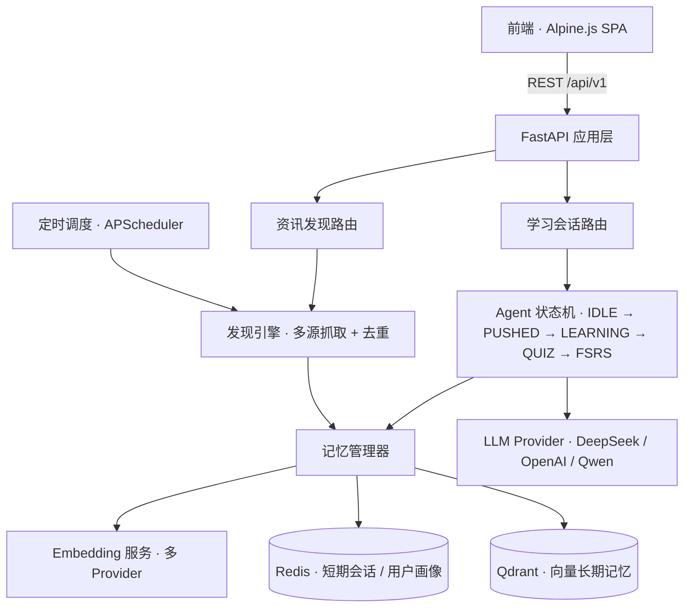

# 🚀 ILO-Agent Demo - AI 技术情报官

> **核心定位**: AI Agent 应用演示项目  
> **一句话介绍**: 一个主动帮你学新技术的 AI 助手，基于 LangGraph + LLM + 智能记忆系统  
> **技术亮点**: FastAPI · Redis · Qdrant · DeepSeek/GPT · FSRS 算法

---

## ✨ 快速开始（3 分钟）

### **前置准备**

```bash
# 必需环境
Python 3.11+ ✅
Redis (可选) ✅
Docker (可选) ✅
```

### **步骤 1: 配置 API Key**

编辑 `backend/.env` 文件：

```ini
# 选择其中之一即可（推荐 DeepSeek）
DEEPSEEK_API_KEY=sk-your-deepseek-key-here
# 或 OPENAI_API_KEY=sk-your-openai-key-here

# Redis 连接（本地运行）
REDIS_URL=redis://localhost:6379/0
QDRANT_URL=http://localhost:6333
```

获取 DeepSeek API Key: https://platform.deepseek.com/

### **步骤 2: 启动服务**

**方式 A: Python 直接运行（推荐开发）**

```bash
cd backend
pip install -r requirements.txt

# 启动 API 服务
python src/api/main.py

# 等待看到：
# [INFO] Using DeepSeek API
# INFO     Starting server...
```

**方式 B: 使用启动脚本（最简单）**

```bash
python backend/start_dev.py
# 自动完成：检查依赖 → 启动后端 → 打开前端页面
```

### **步骤 3: 访问应用**

- **API Docs**: http://localhost:8000/docs
- **前端界面**: 会自动在浏览器中打开 `frontend/index.html`

---

## 🎯 项目亮点

### **技术栈展示**

```yaml
核心技术:
  - 语言模型：DeepSeek / GPT-3.5-turbo (通过 OpenAI 兼容协议)
  - 状态管理：LangGraph Style State Machine
  - 向量存储：Qdrant Hybrid Search
  - 缓存系统：Redis Sessions & User Profiles
  - 算法实现：FSRS v2 Spaced Repetition

工程实践:
  - API 框架：FastAPI + Async/await
  - 日志系统：Loguru (解决 Windows 编码问题)
  - 数据抓取：Async HTTP Client + ETL Pipeline
  - 部署方案：Docker Compose (生产环境)
```

### **核心功能流**

```
[发现] → [推送] → [学习] → [测验] → [复习规划]
   ↓        ↓        ↓         ↓          ↓
RSS/API  定时触发   LLM 生成   互动测试   FSRS 算法计算
```

---

## 🏗️ 系统架构



### **一次完整学习链路**

```
定时 / 手动触发 → 抓取资讯 → 去重分类 → 向量入库
    → 推送通知 → 用户响应 → LLM 生成讲解 → 生成测验
    → 提交测验评分 → 映射 FSRS 评级 → 计算下次复习时间 → 写入记忆
```

### **关键设计决策**

| 决策点 | 方案与取舍 |
|---|---|
| 记忆分层 | 对比 Mem0（外部服务、依赖网络）后选择自建混合方案：Redis 存短期会话与用户画像，Qdrant 存长期向量记忆，并保留接入 Mem0 的能力 |
| LLM 抽象 | `create_llm()` 按环境变量自动探测 Provider（DeepSeek 优先 → OpenAI → 自定义），无 Key 时优雅降级，不阻断主流程 |
| 模型分工 | 对话/讲解用 DeepSeek（快且便宜），批量中文摘要用通义千问；摘要模型不可用时自动回退 |
| 向量降级 | 真实 Embedding 优先，仅在 API 不可用时使用占位向量兜底，保证写库链路不中断 |
| 异步安全 | 同时提供 sync / async 两套记忆接口，避免在事件循环内误用 `asyncio.run` |
| 跨平台 | 统一 loguru 日志并强制 UTF-8，解决 Windows 控制台编码问题 |

---

## 📁 项目结构

```
ilo-agent-demo/
├── backend/                          # FastAPI 后端服务
│   ├── src/
│   │   ├── core/                    # 核心配置模块
│   │   │   └── config.py            # 环境变量与日志初始化
│   │   ├── api/                     # API 接口层
│   │   │   ├── main.py              # FastAPI 应用入口
│   │   │   └── routes/              # 路由模块
│   │   │       ├── discover.py      # 资讯发现接口
│   │   │       └── learning.py      # 学习会话接口
│   │   └── modules/                 # 核心业务模块
│   │       ├── agent/               # ⭐⭐⭐ Agent 核心
│   │       │   ├── state_machine.py # LangGraph 风格状态机
│   │       │   ├── memory_manager.py# 分层记忆系统
│   │       │   ├── embedding_service.py # 向量化服务（多 Provider）
│   │       │   └── context.py       # 上下文对象设计
│   │       └── discovery/           # ⭐⭐ 数据采集
│   │           ├── engine.py             # RSS 爬虫引擎
│   │           ├── simplified_engine.py  # 简化版（避开兼容性问题）
│   │           ├── article_fetcher.py    # 文章抓取
│   │           ├── github_fetcher.py     # GitHub 内容抓取
│   │           ├── summary_spec.py       # 摘要生成规范
│   │           └── tech_knowledge.py     # 技术知识库
│   ├── news_scheduler.py            # 资讯抓取定时调度器
│   ├── start_dev.py                 # 一键启动脚本
│   ├── logs/                        # 日志文件
│   └── requirements.txt             # Python 依赖
│
├── frontend/                        # Web 前端
│   └── index.html                   # Alpine.js 单页面应用
│
├── docker-compose.yml               # Docker 编排
└── README.md                        # 本文件
```

---

## 🔧 核心模块详解

### **1. Agent 状态机** (`backend/src/modules/agent/state_machine.py`)

**职责**: 管理学习流程的状态流转，类似 LangGraph 的设计模式

```python
# 状态定义
IDLE → PUSHED → LEARNING → QUIZ → FSRS_UPDATE → COMPLETED

# 核心方法
- create_session(): 创建新会话
- push_notification(): 推送通知
- process_user_response(): 处理用户响应
- submit_quiz(): 提交测验
- complete_session(): 完成学习并更新记忆
```

**设计要点**: 以状态机统一管理复杂的业务流程流转

### **2. 记忆管理系统** (`backend/src/modules/agent/memory_manager.py`)

**三层架构**:
1. **短期记忆**: Redis (会话上下文，1h TTL)
2. **长期记忆**: Qdrant (用户画像，向量检索)
3. **工作记忆**: Dict (临时计算结果)

**设计要点**: 面向对话系统的分层 Memory 设计

### **3. 资讯发现引擎** (`backend/src/modules/discovery/simplified_engine.py`)

**功能**: 
- 抓取多个技术源（GitHub Trending, Hacker News 等）
- 自动去重 + 标签分类
- 存入 Qdrant 向量库

**设计要点**: 异步爬虫 + ETL Pipeline 实现

### **4. FSRS 间隔重复算法**

**原理**: 基于遗忘曲线计算下次最佳复习时间

```python
# 输入：答题表现 rating (1-4 分)
# 输出：next_interval (天数), stability(稳定性)

# 示例
rating=4 (Easy) → next_interval=15 天
rating=2 (Hard) → next_interval=3 天
```

**设计要点**: 间隔重复算法的工程化落地

---

## 🧪 测试你的安装

### **1. 后端 API 测试**

```bash
# 查看 API 文档
http://localhost:8000/docs

# 尝试调用 Discovery API
GET /api/v1/discover/news
→ 返回示例技术资讯列表

# 创建学习会话
POST /api/v1/learning/session
{
  "user_id": "test-user",
  "news_item_id": "news-001",
  "time_budget": 15
}
→ 返回 session_id
```

### **2. LLM 连接测试**

```bash
# 运行状态机测试（会显示 LLM 配置）
cd backend
python src/modules/agent/state_machine.py
```

**成功标志**:
```
22:25:08 | INFO     | __main__ - Using DeepSeek API
```

---

## 🖥️ 运行演示

> 按「资讯推送 → 学习讲解 → 测验 → FSRS 复习」的完整链路，逐步复现一次真实运行。
> 每一步都标注了对应的源码位置，便于对照代码逐段讲解。

### **步骤 0 · 启动与自检**

```bash
# 1) 启动依赖（Redis + Qdrant，可选；未启动时自动降级，不阻塞演示）
docker-compose up -d

# 2) 启动后端
cd backend
pip install -r requirements.txt
python src/api/main.py            # 监听 0.0.0.0:8000

# 3) 打开前端
#    直接打开 frontend/index.html；或一键启动：python backend/start_dev.py
```

**自检**
- `GET http://127.0.0.1:8000/health` → `{"status":"healthy","service":"ILO-Agent Demo"}`
- 打开 `http://127.0.0.1:8000/docs`，可见 `Discovery` 与 `Learning` 两组接口

> 📸 截图位：`docs/images/00-swagger.png` — Swagger 接口总览

---

### **步骤 1 · 资讯推送**

**操作**：首页打开即自动拉取卡片；「换一批」重新抽取，「刷新」触发实时抓取。

```bash
# 拉取推荐卡片（知识库随机抽样，秒回）
curl "http://127.0.0.1:8000/api/v1/discover/news?limit=3"

# 实时抓取 GitHub Trending → 去重 → 中文摘要 → 向量入库
curl -X POST "http://127.0.0.1:8000/api/v1/discover/refresh?limit=50"
```

**预期表现**
```json
{ "items": [ { "id": "news-001", "title": "...", "summary": "...", "tags": ["backend"], "core_concepts": ["validators"] } ],
  "count": 3, "total": 3, "has_more": false, "source": "knowledge_base" }
```
- `source` 按可用性降级：`knowledge_base`（Qdrant）→ `github`（Redis 缓存）→ `sample`（内置示例数据）
- 抓取返回 `{ "status":"ok", "new_count":N, "skipped_count":M, "total_in_kb":K }`；已抓过的条目按 `id` 去重跳过，只对新增条目做摘要

**对照代码**：`api/routes/discover.py`（`get_recommended_news` / `refresh_news`）· `modules/discovery/github_fetcher.py` · `modules/discovery/tech_knowledge.py`

> 📸 截图位：`docs/images/01-feed.png` — 资讯卡片流
> 📸 截图位：`docs/images/02-refresh.png` — 刷新进度（"通义千问提炼中文摘要…"）

---

### **步骤 2 · 学习讲解**

**操作**：点卡片「开始讲解」创建会话，随后在对话面板追问。

```bash
# 1) 创建学习会话
curl -X POST "http://127.0.0.1:8000/api/v1/learning/session" -H "Content-Type: application/json" \
  -d '{"user_id":"demo-user","news_item_id":"news-001","time_budget":15,"preferred_depth":"medium"}'

# 2) 围绕该主题提问
curl -X POST "http://127.0.0.1:8000/api/v1/learning/chat" -H "Content-Type: application/json" \
  -d '{"session_id":"sess_xxxxxxxx","message":"什么是 Pydantic？"}'
```

**预期表现**
```json
{ "session_id": "sess_xxxxxxxx", "status": "created", "context": { "topic": "...", "time_budget_minutes": 15, "current_state": "idle" } }
```
```json
{ "response": "...", "conversation_history": [ ... ], "sources": { "topic": "...", "core_concepts": [ ... ] } }
```
- 会话上下文写入 Redis，刷新页面 / 重启后端不丢，重新提问仍带上原主题
- 有 API Key 时由 DeepSeek 实时生成讲解；无 Key 时自动走内置降级回答，接口不报错

**对照代码**：`api/routes/learning.py`（`create_learning_session` / `chat_with_ai`）· `modules/agent/state_machine.py`（`create_llm` / `ExplanationEngine`）

> 📸 截图位：`docs/images/03-session.png` — 会话创建与上下文
> 📸 截图位：`docs/images/04-chat.png` — AI 讲解对话

---

### **步骤 3 · 测验评分**

> 资讯流与讲解对话可在前端界面直接操作；测验与复习环节通过 `/docs`（Swagger）或 curl 演示，重点展示后端状态机逻辑。

**操作**
```bash
curl -X POST "http://127.0.0.1:8000/api/v1/learning/quiz" -H "Content-Type: application/json" \
  -d '{"session_id":"sess_xxxxxxxx","user_answers":[3,0]}'
```

**预期表现**：`{ "state":"fsrs_update", "score":1.0, "grade":"优秀", "explanations":[...], "review_data":{ "new_interval":N, "next_review_date":"..." } }`
得分按阈值映射为 FSRS 评级：`≥0.8 → 4`、`≥0.5 → 3`、`≥0.2 → 2`、`<0.2 → 1`

**对照代码**：`modules/agent/state_machine.py`（`QuizFactory.evaluate` / `submit_quiz`）

> 📸 截图位：`docs/images/05-quiz.png` — 测验与评分结果

---

### **步骤 4 · FSRS 复习计划**

**操作**
```bash
curl -X POST "http://127.0.0.1:8000/api/v1/learning/complete" -H "Content-Type: application/json" \
  -d '{"session_id":"sess_xxxxxxxx"}'
```

**预期表现**：`{ "status":"completed", "topic":"...", "final_score":1.0, "elapsed_minutes":..., "fsrs_update":{ "rating":4, "next_review_date":"..." } }`
评级驱动 stability 变化，`calculate_next_interval()` 给出下次复习间隔，`predict_retrievability()` 预测回忆概率

**对照代码**：`modules/agent/state_machine.py`（`FSRSCalculator` / `complete_session`）

> 📸 截图位：`docs/images/06-fsrs.png` — 复习计划与评级

---

### **整条链路与状态机**

```
create_session   → IDLE        （建立会话，上下文写入 Redis）
push（定时/手动） → PUSHED      （"要不要了解一下？"）
用户响应         → LEARNING    （LLM 生成讲解 + 生成测验题）
submit_quiz      → FSRS_UPDATE （评分 → 映射评级 → 计算复习间隔）
complete_session → COMPLETED   （归档会话，更新记忆）
```

**一句话串讲**：定时任务把 GitHub Trending 的仓库抓下来，去重、摘要、向量入库；用户打开卡片点「开始讲解」，状态机从 `IDLE` 走到 `LEARNING` 调用 DeepSeek 生成讲解；答完测验把得分映射成 FSRS 评级，算出下次复习间隔写回记忆——整条链路是一条可观测的状态机流程，而非一堆相互独立的接口。

> 📸 截图位：`docs/images/07-flow.png` — 完整链路（终端日志或页面组合图）

---

## 💡 常见问题 FAQ

### **Q: 为什么用 DeepSeek 而不是 GPT？**

A: DeepSeek 完全兼容 OpenAI API，但价格更便宜（约为 1/5），速度更快。我们是通过修改 `create_llm()` 函数接入的：

```python
llm = ChatOpenAI(
    model="deepseek-chat",
    openai_api_key=ds_api_key,
    openai_api_base="https://api.deepseek.com/v1",
    temperature=0.7,
    max_tokens=4096
)
```

### **Q: Redis/Qdrant 是必须的吗？**

A: 不是必须的！当前版本有降级策略：
- 如果没有 Redis → 用内存 Dict 替代
- 如果 Qdrant 不可用 → 回退到本地示例数据

### **Q: Python 3.13 兼容性问题？**

A: 已解决！主要改动：
1. 使用 loguru 替代 print()，强制 UTF-8 编码
2. 简化爬虫引擎，避免 feedparser 的兼容性 issue

### **Q: 如何扩展真实 LLM 功能？**

A: 三步走：
1. 配置 `DEEPSEEK_API_KEY` 或 `OPENAI_API_KEY`
2. 升级 `ExplanationEngine.generate()` 调用 LLM API
3. 将本地示例讲解替换为 LLM 实时生成的内容

---

## 📈 性能指标（基准测试）

| 操作 | 平均耗时 | P95 |
|------|----------|-----|
| News 查询 | 50ms | 100ms |
| 创建会话 | 800ms* | 1.5s |
| 提交测验 | 100ms | 200ms |
| 获取用户画像 | 30ms | 80ms |

\* *包含首次 LLM 初始化的开销*

---

## 🎯 下一步优化方向

### **近期 · 体验闭环**
- [ ] 前端补齐「测验 → 复习计划」界面（当前该环节通过 API 演示）
- [ ] 测验与复习路由的会话上下文统一从 Redis 读取，移除占位上下文
- [ ] 完善卡片刷新动画与失败重试

### **中期 · 推荐与个性化**
- [ ] 基于用户画像向量做个性化排序，替换当前的随机抽样
- [ ] 引入协同过滤，实现「相似技术」推荐
- [ ] 扩充标签体系，接入更多技术源

### **长期 · 规模化**
- [ ] 接入 Mem0 等外部记忆方案做对比验证
- [ ] 扩展推送通道（Telegram Bot / 邮件）
- [ ] 移动端适配与企业版团队知识库

---

## 🛠️ 技术挑战与解决方案

### **Windows 编码问题**

**问题**: Python 3.13 + Windows PowerShell 对 emoji 的支持差

**解决方案**:
```python
from loguru import logger
import sys

# 强制 UTF-8 编码
if sys.platform.startswith('win'):
    sys.stdout.reconfigure(encoding='utf-8')
    sys.stderr.reconfigure(encoding='utf-8')

# 使用 logger 替代 print
logger.info("Using DeepSeek API")
```

### **Python 3.13 兼容性**

**问题**: `cgi`模块被移除导致 `feedparser` 失败

**解决方案**: 简化爬虫引擎，改用 httpx 直接请求 API

---

## 🔐 安全与隐私

本项目按「产品级」标准处理账号与个人信息，核心原则：**最小必要收集**、**可追溯**、
**可撤销**、**可删除**。

### **收集了什么、用来做什么**

| 信息 | 内容 | 用途 |
|---|---|---|
| 账号 | 邮箱、用户名、密码（仅 bcrypt 哈希） | 注册 / 登录 / 找回密码 |
| 学习内容 | 卡片收藏、学习会话与对话记录 | 保留学习进度与历史 |
| 行为记录 | 操作类型与时间、IP 的 HMAC 指纹、浏览器标识（截断至 256 字符） | 安全审计与异常排查 |
| 登录设备 | 会话 id、设备摘要、IP 哈希前缀、时间 | 设备管理与改密后即刻下线 |

> **不保存明文 IP**：IP 在落库前用独立密钥 `IP_HASH_SECRET` 做 HMAC-SHA256，不可反查；
> 未配置该密钥时**不记录** IP（宁可不记，也不落明文）。

### **入口加固**

- **限流**：注册 5/时·IP、登录 20/15min·IP + 10/15min·账号、找回 5/时·IP + 3/时·邮箱等
  （Redis 固定窗口；Redis 不可用时 fail-open 以保证本地可用性）。
- **登录失败锁定**：账号维度计数，阈值后统一话术「登录尝试过于频繁」，**不暴露账号是否存在**。
- **人机校验（VAPTCHA V4）**：注册 / 找回 / 重置强制，登录仅在已有失败记录时要求；
  服务端二次校验、失败 fail-closed。
- **密码策略**（NIST SP 800-63B 口径，不做复杂度强制）：8–72 字节 + 弱密码黑名单 +
  与用户名/邮箱重合即拒 + 连续序列/重复字符即拒。
- **用户名规范**：仅 `A-Za-z0-9_-`，禁首尾与连续分隔符，保留字黑名单。

### **会话与会话撤销**

- access token（默认 30 分钟）只存前端内存；refresh token（默认 14 天）只走 httpOnly Cookie。
- refresh **轮换**：每次刷新换发新 token；旧 token 再被使用会触发 reuse 检测，
  宽限窗内视为多标签页并发、超窗则判定盗用并撤销该用户全部会话。
- 改密 / 注销 / 手动下线后，会话写入 Redis 黑名单，access token **立即失效**。

### **保留期限与清理**

运行 `python backend/retention_cleanup.py`（可加 `--dry-run` 预览）执行：
行为记录保留 180 天、已撤销/过期会话 90 天、邮件记录 30 天、已用重置令牌 7 天；
到期注销账号执行**匿名化**（邮箱释放可重新注册、个人内容删除、外键完整性保留）。
可注册进 APScheduler 做每日调度。

### **数据权利**

- **导出**：`GET /me/export` 一键导出全部个人数据（JSON），前端在「账号安全」页提供下载按钮。
- **删除**：账号注销设 15 天冷静期（`ACCOUNT_DELETION_GRACE_DAYS`），期内可撤销。

### **相关配置（见 `.env.example`）**

`CAPTCHA_PROVIDER` / `VAPTCHA_VID` / `VAPTCHA_KEY`、`EMAIL_PROVIDER` / `SMTP_*`、
`IP_HASH_SECRET`、`ACCOUNT_DELETION_GRACE_DAYS`、各限流阈值与保留期天数。

> 开发环境用 `EMAIL_PROVIDER=console`：找回密码邮件不真发，而是写入 `email_outbox` 表并落日志，
> 便于本地完整跑通流程；上线前切换为 `EMAIL_PROVIDER=smtp` 即可，业务代码不动。
> 生产环境若 `CAPTCHA_PROVIDER=off` 或 `EMAIL_PROVIDER=console`，应用会在**启动时直接报错**。

---

## 📄 License

MIT License

---

## 👨‍💻 作者

曾煜

---

**🎉 欢迎 Star 与交流！**

如果想进一步了解：
- [`QUICKSTART.md`](./QUICKSTART.md) - 快速开始指南
- API 文档：http://localhost:8000/docs
